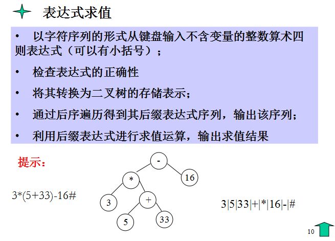
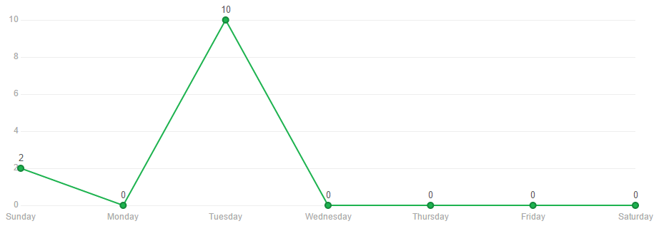
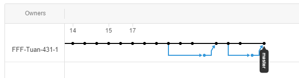
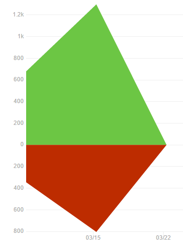

# 四则运算程序第一版文档

* **班级：** 2013211313
* **小组成员：** 彭俊喆、李雄伟、兰玉鹍
* **学号：** 2013211535、2013211536 2013211540

## 题目要求及概述：

## 分工情况：

* 李雄伟：负责主要逻辑编写
* 彭俊喆：负责代码重构优化
* 兰玉鹍：编写测试文件、文档

###代码统计：
* Contribution:

* Commit：

* Branch：

* Codes：

##代码规范以及工作流：

###代码规范

我们制定了共同的代码规范，这一点可以在我们的代码中体现，从变量的命名，到缩进，花括号的位置，无一不体现了我们对代码质量的极度追求。

###构建工具

我们使用了共同的IDE：**Clion**，同时，我们使用了跨平台开源的构建系统**Cmake**，使得我们的代码在任何一个主流平台都可以构建，运行。

###代码管理

我们采用**git**作为版本控制工具，使用**GitHub**作为我们的
[代码仓库](https://github.com/FFF-Tuan-431-1/expression)。这样可以使我们进行快速的分布式迭代开发，并且可以保存每一个阶段的代码，避免不必要的麻烦。

###开发模式

我们的开发模式为『一次开发，多次迭代，渐进增强』的高效率开发，并且以『重构』为核心。我们的核心代码在最初的几次commit中就已经完成，后来逐步重构: 模块化、对象化、新功能开发、代码复用，都是在不断的重构迭代中完成的。

统计中，我们可以看出，我们新增代码行数为1.2k，删除的代码为0.8k。

最后，我们在2天内实现了多人合作开发，证明了我们的效率，也证明了我们开发模式的正确。

##数据结构设计方案：

###总体设计方案

我们使用**模块化设计**，从功能上把代码划分成数个模块。每一个模块之间都是相互独立的，这使得我们随时修改任一模块，而不会影响其他模块的功能。

同时，我们采用**面向对象**对代码进行了封装，使得每个模块只暴露出使用的接口，隐藏内部具体实现，编写代码更轻松。

###具体模块

1. Calculator类
	
	Calculator类是『计算器』的抽象实现，接受一段表达式的输入，返回表达式结果等。
	接口：
	* setExpression(string s) 设置计算器需要计算的表达式
	* getAnswer() 计算表达式结果
	* isError() 判断表达式是否有误
	* getSuffix() 获取后缀表达式

2. Check类
	Check类用来判断表达式是否是合法的四则运算表达式。我们采用了有限状态自动机，共有四个状态：『数字』、『操作符』、『左括号』、『右括号』。只有在四个状态都顺利进行完毕时表达式为合法表达式，当某一个状态返回error则表达式错误。

	接口：
	* checkError() 判断表达式是否错误

3. Suffix类
	
	Suffix类用来将中缀表达式，转换成后缀表达式，我们通过二叉树来实现。**此处插入二叉树的逻辑**
	
	接口：
	* getSuffix()

4. Cell类

	Cell类是对数据的封装，辅助Suffix类进行转换。
	
5. Util类

	Util类封装了其他类需要用到的公用helper方法，实现代码重用。

## 测试：
为了保证迭代开发中，代码的功能不受影响，我们另外还添加了测试文件。

测试文件使用了assert()函数作为断言测试，监测我们代码的基本功能是否正确，计算器大部分功能已通过断言测试，剩余三个测试未通过

1. 除数为0时应为非法输入
2. 负数应为合法输入
3. 计算中出现负数可能会出现异常

具体测试情况详见test.cpp。

## 未来的计划：

- 完善代码，通过所有的测试
- 添加新功能，如三角函数等简单函数的运算

## 自我评价：
> 通过这次程序，复习了C++大部分知识，学会了使用Git进行多人协作开发，最重要的是学习了新的界面图形化方法（QT-QUICK），希望在之后的图形化版本中能接触到更多优秀的方法和简洁的代码。
>   ——兰玉鹍

> 
  