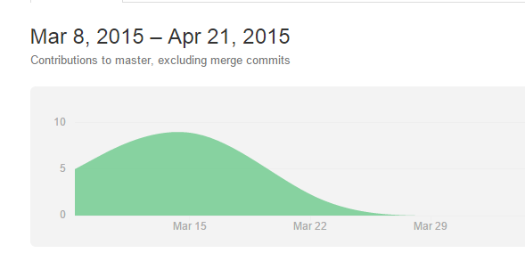

# 四则运算程序第一版文档

* **班级：** 2013211313
* **小组成员：**彭俊喆 李雄伟 兰玉鹍
* **学号：** 2013211535 2013211536 2013211540

## 题目要求及概述：

## 分工情况：

* 李雄伟：主要功能编写，自动机查错Check模块，Util模块，Suffix模块第二版
* 彭俊喆：代码重构，解决代码逻辑性问题，完善程序功能，Cell模块编写，Suffix模块最终版
* 兰玉鹍：测试程序编写test.cpp，文档编写，Suffix模块第一版

###GitHub数据：
* Contribution:

* Vistor访问情况：

* Commit图：

* master分支与子分支合并情况：

* 原始代码与重构代码的比例图：

##代码规范以及工作流：
......

##数据结构设计方案：
* **总体设计方案：**采用嵌套思路，用户使用时仅仅可以知道它只是一个Calculator,具体功能都是在Calculator模块中联合调用的，这样的方式也可给之后的图形化版本提供便利。

* **Calculator模块：**
1.功能：提供四则运算具体方法，结果输出，后缀表达式输出，判错输出及接受中缀算式

 2.具体函数：
* int Calculate::calculate(char opera, int a, int b)
* Calculate::Calculate(string s)
* void Calculate::setExpression(string s)
* int Calculate::getAnswer()
* bool Calculate::isError()
* string Calculate::getSuffix()

* **Check模块:**
1.功能：提供用户输入表达式的合法性判断功能，采用自动机的查错思路，分为数字状态，操作符状态，左括号状态及右括号状态四个状态，只有在四个状态都顺利进行完毕时表达式为合法表达式，当某一个状态返回error则表达式错误

 2.具体函数：
* bool Check::stateNum(int i, int &lb)
* bool Check::stateOper(int i, int &lb)
* bool Check::stateLBra(int i, int &lb)
* bool Check::stateRBra(int i, int &lb)
* Check::Check(string s)
* bool Check::checkError()

* **Util模块:**
1.功能：用于判断输入表达式中的当前位置是数字，操作符，还是左括号或右括号，并提供一个将后缀表达式中的数字转换为字符串的方法

 2.具体函数：
* bool Util::isNumber(char ch)
* bool Util::isOperator(char ch)
* bool Util::isLeftBracket(char ch)
* bool Util::isRightBracket(char ch)
* std::string Util::intToString(int number)

* **Cell模块：**
1.功能：该模块为一个包含两种数据类型的类（int和char）,类似c中的structure,主要用于解决输入多位数字程序无法将多位数字完整输出的问题（如：22若直接用循环输出的方法将其转换成字符的话得到的结果为两个‘2’字符）,并提供操作符优先级判断方法

 2.具体函数：
* Cell::Cell()
* Cell::Cell(int t_num)
* Cell::Cell(char t_opt)
* bool Cell::isNumber()
* bool Cell::isLeftBracket()
* bool Cell::isRightBracket()
* bool Cell::isOperator()
* bool Cell::checkPriority(Cell first, Cell second)
* int Cell::getPriority()

* **test测试模块：**
1.功能：使用assert断言对计算器功能进行判断

 2.具体函数：
* int main()

* **Suffix模块:**
......

## 测试：
  计算器大部分功能已通过断言测试，剩余三个测试未通过
1.除数为0时应为非法输入
2.负数应为合法输入
3.计算中出现负数可能会出现异常

  具体测试情况详见test.cpp。

## 未来的计划：
  完善测试中出现的问题，调整第二版本图形化界面的样式，进一步增加一些附加功能

## 自我评价：
  通过这次程序，复习了C++大部分知识，学会了使用Git进行多人协作开发，最重要的是学习了新的界面图形化方法（QT-QUICK），希望在之后的图形化版本中能接触到更多优秀的方法和简洁的代码。  ——兰玉鹍
  